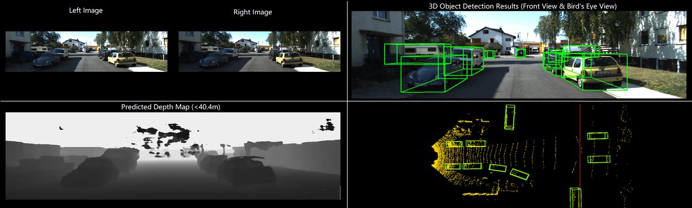
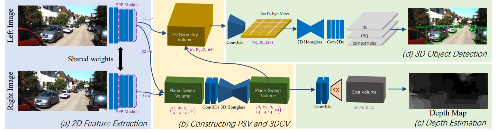

# DSGN
## Deep Stereo Geometry Network for 3D Object Detection

DSGN is a 3D object detector with only input of a stereo image pair, which can jointly **estimate depth** and **detect 3D objects**. 

[[arXiv]](https://arxiv.org/abs/2001.03398)&nbsp;  [[Demo]](https://www.youtube.com/watch?v=u6mQW89wBbo)&nbsp;

 

### Method

 

### Demo

We provide a [video demo](https://www.youtube.com/watch?v=u6mQW89wBbo) for showing the result of DSGN. Here we show the predicted depth map and 3D detection results on both front view (the left camera view) and bird's eye view (the ground-truth point cloud).

### Code
Code will be made available.

### Contacts
Yilun Chen (chenyilun95@gmail.com)

