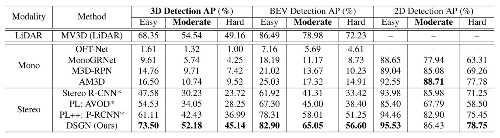
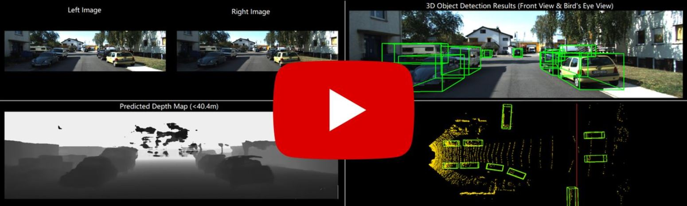

# DSGN
## Deep Stereo Geometry Network for 3D Object Detection (CVPR 2020)

This is the official implementation of DSGN (CVPR 2020), a strong 3D object detector proposed to jointly **estimate scene depth** and **detect 3D objects** in 3D world with only input of a stereo image pair.

<div align="center">
 
</div>

**DSGN: Deep Stereo Geometry Network for 3D Object Detection**<br/>
[Yilun Chen](http://yilunchen.com/about/), [Shu Liu](http://shuliu.me/), [Xiaoyong Shen](http://xiaoyongshen.me/), [Jiaya Jia](http://jiaya.me/). <br/>
[[Paper]](https://arxiv.org/abs/2001.03398)&nbsp;  [[Video]](https://www.youtube.com/watch?v=u6mQW89wBbo)&nbsp; 

Most state-of-the-art 3D object detectors heavily rely on LiDAR sensors and there remains a large gap in terms of performance between image-based and LiDAR-based methods, caused by inappropriate representation for the prediction in 3D scenarios. Our method, called Deep Stereo Geometry Network (DSGN), reduces this gap significantly by detecting 3D objects on a differentiable volumetric representation – 3D geometric volume, which effectively encodes 3D geometric structure for 3D regular space. With this representation, we learn depth information and semantic cues simultaneously. For the first time, we provide a simple and effective one-stage stereo-based 3D detection pipeline that jointly estimates the depth and detects 3D objects in an end-to-end learning manner. Our approach outperforms previous stereo-based 3D detectors (about 10 higher in terms of AP) and even achieves comparable performance with a few LiDAR-based methods on the KITTI 3D object detection leaderboard.

### Overall Pipeline

<div align="center">
 
 <p><font size="2">DSGN consists of four components: (a) A 2D image feature extractor for capture of both pixel-level and high-level feature. (b) Constructing the plane-sweep volume and 3D geometric volume. (c) Depth Estimation on the plane-sweep volume. (d) 3D object detection on 3D geometric volume.</font></p>
</div>

### Reported Results on KITTI Leaderboard

<p align="center"> </p>

### Requirements
All the codes are tested in the following environment:
* Ubuntu 16.04
* Python 3.7
* PyTorch 1.1.0 or 1.2.0 or 1.3.0
* Torchvision 0.2.2 or 0.4.1

The models reported in paper are trained with 4 *NVIDIA Tesla V100* (32G) GPUs with batch-size 4. The training GPU memory requirement is close to 29G and the testing GPU memory requirement is feasible for a normal *NVIDIA TITAN* (12G) GPU. One full image pair is fed into the network and used to construct the 3D volume. For your reference, PSMNet is trained with input patch size of 512x256. Please note your GPU memory. 

### Installation

(1) Clone this repository.
```
git clone https://github.com/chenyilun95/DSGN.git && cd DSGN
```

(2) Setup Python environment.
```
conda activate -n dsgn
pip install -r requirements.txt --user

## conda deactivate dsgn
```

(3) Compile the rotated IoU library. 
```
cd dsgn/utils/rotate_iou && bash compile.sh & cd ../../../
```

(4) Compile and install DSGN library.
```
# the following will install the lib with symbolic links, so that
# you can modify the file if you want and won't need to re-build it.
python3 setup.py build develop --user
```

### Data Preparation

(1) Please download the KITTI dataset and create the model folders. KITTI dataset is avaible [here](http://www.cvlibs.net/datasets/kitti/eval_object.php?obj_benchmark=3d). Download KITTI [point clouds](https://s3.eu-central-1.amazonaws.com/avg-kitti/data_object_velodyne.zip), [left images](https://s3.eu-central-1.amazonaws.com/avg-kitti/data_object_image_2.zip), [right images](https://s3.eu-central-1.amazonaws.com/avg-kitti/data_object_image_3.zip), [calibrations matrices](https://s3.eu-central-1.amazonaws.com/avg-kitti/data_object_calib.zip) and [object labels](https://s3.eu-central-1.amazonaws.com/avg-kitti/data_object_label_2.zip). 
```
ln -s /path/to/KITTI_DATA_PATH ./data/kitti/
ln -s /path/to/OUTPUT_PATH ./outputs/
```

(2) Generate the depth map from the ground-truth LiDAR point cloud and save them in ./data/kitti/training/depth/.
```
python3 preprocessing/generate_disp.py --data_path ./data/kitti/training/ --split_file ./data/kitti/trainval.txt 
python3 preprocessing/generate_disp.py --data_path ./data/kitti/training/ --split_file ./data/kitti/trainval.txt --right_calib
```

(3) Pre-compute the bbox targets in pre-defined grid and save them in ./outputs/temp/.
```
python3 tools/generate_targets.py --cfg CONFIG_PATH
```

After training the models, the overall directory will look like below:
```
.                                           (root directory)
|-- dsgn                                    (dsgn library file)
|-- configs                                 (model configurations folder)
|-- ...
|-- data
|   |-- kitti                               (dataset directory)
|       |-- train.txt                       (KITTI train images list (3712 samples))
|       |-- val.txt                         (KITTI val images list (3769 samples))
|       |-- test.txt                        (KITTI test images list (7518 samples))
|       |-- training
|       |   |-- image_2
|       |   |-- image_3
|       |   |-- ...
|       |-- testing
|       |-- depth                           (generated depth map)
|-- outputs
    |-- MODEL_DSGN_v1                       (Model config and snapshots should be saved in the same model folder)
        |-- finetune_53.tar                 (saved model)
        |-- save_config.py                  (saved model configuration file)
        |-- save_config.py.tmp              (automatic generated copy of previous configuration)
        |-- training.log                    (full training log)
        |-- result_kitti_finetune_53.txt    (kitti evaluated results for the saved model)
        |-- kitti_output                    (kitti detection results folder)
    |-- MODEL_DSGN_v2
    |-- temp                                (temporary folder for saving the pre-computed bbox targets)
        |-- ...                             (pre-computed bbox targets under some specific configurations)
```

### Multi-GPU Training

The training scripts support [multi-processing distributed training](https://github.com/pytorch/examples/tree/master/imagenet), which is much faster than the typical PyTorch DataParallel interface.
```
python3 tools/train_net.py --cfg ./configs/config_xxx.py --savemodel ./outputs/MODEL_NAME -btrain 4 -d 0-3 --multiprocessing-distributed
```
or
```
bash scripts/mptrain_xxx.sh
```
The training models, configuration and logs will be saved in the model folder.

To load some pretrained model, you can run
```
python3 tools/train_net.py --cfg xxx/config.py --loadmodel ./outputs/MODEL_NAMEx --start_epoch xxx --savemodel ./outputs/MODEL_NAME -btrain 4 -d 0-3 --multiprocessing-distributed
```
If you want to continue training from some epochs, just set the cfg, loadmodel and start_epoch to the respective model path.

Besides, you can start a tensorboard session by
```
tensorboard --logdir=./outputs/MODEL_NAME/tensorboard --port=6666
```
and visualize your training process by accessing https://localhost:6666 on your browser.

### Inference and Evaluation

Evaluating the models by
```
python3 tools/test_net.py --loadmodel ./outputs/MODEL_NAME -btest 8 -d 0-3
```
KITTI Detection results and evaluation results will be saved in the model folder. 

### Performance and Model Zoo

We provide several pretrained models for our experiments, which are evaluated on KITTI val set.

<table>
    <thead>
        <tr>
            <th>Methods</th>
            <th>Epochs</th>
            <!-- <th>Inference Time(s/im)</th> -->
            <th>3D AP</th>
            <th>BEV AP</th>
            <th>2D AP</th>
            <th>Models</th>
        </tr>
    </thead>
    <tbody>
        <tr>
            <td>DSGN(Car)</td>
            <td>53</td>
            <td>53.95</td>
            <td>64.44</td>
            <td>84.62</td>
            <td><a href="https://drive.google.com/open?id=1pbvyRGOknlovmIK96MwEyvV0_z76Bfks"> GoogleDrive </a></td>
        </tr>
        <tr>
            <td>DSGN(Pedestrian)</td>
            <td rowspan=2>27</td>
            <td>31.42</td>
            <td>39.35</td>
            <td>55.68</td>
            <td rowspan=2><a href="https://drive.google.com/open?id=1L14QisrQMyIbowhSSOf_FjaOx9CVe0oF"> GoogleDrive </a></td>
        </tr>
        <tr>
            <td>DSGN(Cyclist)</td>
            <td>23.16</td>
            <td>24.81</td>
            <td>32.86</td>
        </tr>
    </tbody>
</table>

### Video Demo

We provide a video demo for showing the result of DSGN. Here we show the predicted depth map and 3D detection results on both front view (the left camera view) and bird's eye view (the ground-truth point cloud).

<p align="center"> <a href="https://www.youtube.com/watch?v=u6mQW89wBbo"></a> </p>

### TODO List
- [x] Multiprocessing GPU training
- [x] TensorboardX
- [ ] Result visualization
- [ ] Reduce training GPU memory usage
- [ ] Still in progress

### Troubleshooting

If you have issues running or compiling this code, we have compiled a list of common issues in [TROUBLESHOOTING.md](TROUBLESHOOTING.md). If your issue is not present there, please feel free to open a new issue.

### Citations
If you find our work useful in your research, please consider citing:
```
@article{chen2020dsgn,
  title={DSGN: Deep Stereo Geometry Network for 3D Object Detection},
  author={Chen, Yilun and Liu, Shu and Shen, Xiaoyong and Jia, Jiaya},
  journal={Proceedings of the IEEE Conference on Computer Vision and Pattern Recognition},
  year={2020}
}
```

### Acknowledgment
This repo borrows code from several repos, like [maskrcnn-benchmark](https://github.com/facebookresearch/maskrcnn-benchmark), [PSMNet](https://github.com/JiaRenChang/PSMNet), [FCOS](https://github.com/tianzhi0549/FCOS) and [kitti-object-eval-python](https://github.com/traveller59/kitti-object-eval-python).

### Contact
If you have any questions or suggestions about this repo, please feel free to contact me (chenyilun95@gmail.com).

